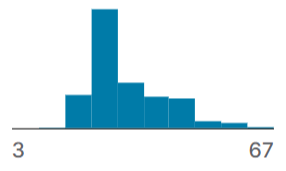
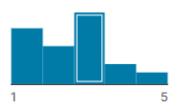
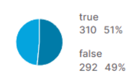
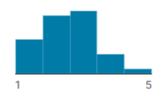
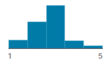

# Projeto Aplicado I

# Amazon: Uma análise de performance e de oportunidades

## Sumário

- [📚 Contexto do Estudo](#-contexto-do-estudo)
- [💻 Referências de Aquisição do Dataset](#-referências-de-aquisição-do-dataset)
  - [Sales Product Data](#sales-product-data)
  - [Amazon Consumer Behaviour Dataset](#amazon-consumer-behaviour-dataset)
  - [Amazon Sales Dataset](#amazon-sales-dataset)
- [🌎 Descrição da Origem](#-descrição-da-origem)
- [📊 Descrição do Dataset](#-descrição-do-dataset)
- [🔎 Solução Analítica](#-solução-analític)
- [📈 Apresentação dos Metadados e Análise Exploratória de Dados](#-Apresentação-dos-Metadados-e-Análise-Exploratória-de-Dados)
- [🤝 Colaboradores](#-colaboradores)
- [📝 Licença](#-licença)

### Pastas do Projeto

- [Datasets](Datasets)
  - [Sales Product Data](Datasets/Sales%20Product%20Data)
  - [Amazon Consumer Behaviour Dataset](Datasets/Amazon%20Consumer%20Behaviour%20Dataset)
  - [Amazon Sales Dataset](Datasets/Amazon%20Sales%20Dataset)
- [Imagens Utilizadas](Imagens)
- [Cronograma](Cronograma)

## 📚 Contexto do Estudo

> Esse trabalho foi desenvolvido com a finalidade de avaliar quais são os produtos que apresentam melhor desempenho no e-commerce da Amazon e identificar, no mercado em geral, produtos com potencial significativo que podem ser grandes oportunidades para gerar mais receita para a empresa. Outra análise realizada é em relação aos hábitos de consumo dos clientes da Amazon, o que é de grande valia, pois essa análise influencia no processo de determinar quais produtos são pertinentes para serem incluídos no catálogo da empresa.  
>
> Nesse contexto, utilizamos datasets públicos que oferecem dados de grande valia para a análise realizada. Com esse estudo a empresa pode incluir produtos que vão gerar mais receita, fazer ofertas mais assertivas para sua base de clientes e, consequentemente, gerar mais vendas. 

## 💻 Referências de Aquisição do Dataset

>Neste projeto, utilizamos três conjuntos de dados como base para a realização das análises e experimentos. Abaixo estão as informações detalhadas sobre cada um dos datasets:

### Sales Product Data
- Link: [Sales Product Data](https://www.kaggle.com/datasets/knightbearr/sales-product-data)
- Origem dos dados: Kaggle
- Limitação de uso: CC0: Public Domain
- Período da coleta: De abril a setembro de 2019

### Amazon Consumer Behaviour Dataset
- Link: [Amazon Consumer Behaviour Dataset](https://www.kaggle.com/datasets/swathiunnikrishnan/amazon-consumer-behaviour-dataset)
- Origem dos dados: Kaggle
- Limitação de uso: Outra (especificada na descrição)
- Período da coleta: [Informe o período da coleta aqui]

### Amazon Sales Dataset
- Link: [Amazon Sales Dataset](https://www.kaggle.com/datasets/karkavelrajaj/amazon-sales-dataset)
- Origem dos dados: Amazon
- Limitação de uso: CC BY-NC-SA 4.0
- Período da coleta: [Informe o período da coleta aqui]

## 🌎 Descrição da Origem

>Os dados foram retirados da plataforma Kaggle no qual possuí alguns datasets públicos. Como a ideia inicial era avaliar dados de produtos e clientes, encontramos a disponibilização dos dados da Amazon dentro da plataforma, no momento considerados começar por três datasets no qual se relaciona com as vendas de produtos da amazon. 
>  
>Sendo o primeiro dataset (Amazon Sales Dataset) extraído do site oficial da Amazon, por meio de BeautifulSoup e WebDriver usando Python. O segundo dataset (Amazon Consumer Behaviour Dataset), é um conjunto de dados primário auto coletado para analisar o comportamento do consumidor na Amazon, portanto, coletados por meio do Google Forms. E o terceiro encontrado no github, pelo criador que colocou no Kaggle, esse não fica explícito que os dados são da amazon em sua descrição, no entanto em seu metadados a explicação da coluna ID deixa claro que os dados são da amazon (‘‘Um ID de pedido é o sistema numérico que a Amazon usa exclusivamente para rastrear pedidos.’’), importante ressaltar que essas informações são disponibilizadas no próprio Kaggle no link do dataset.

## 📊 Descrição do Dataset

- ###  Amazon consumer Behaviour Dataset

> Conjunto de dados coletados para analisar a análise comportamental dos consumidores da Amazon e consiste em uma coleção abrangente de interações com clientes e padrões de navegação no ecossistema amazônico. Inclui uma ampla gama de variáveis, como dados demográficos do cliente, interação do usuário e avaliações. O conjunto de dados visa fornecer insights sobre as preferências dos clientes, hábitos de compra e processos de tomada de decisão na plataforma Amazon.  
>
>Ao analisar esse conjunto de dados, pesquisadores e analistas podem obter uma compreensão mais profunda do comportamento do consumidor, identificar tendências, otimizar estratégias de marketing e melhorar a experiência geral do cliente na Amazon.  
> 
>Perguntas seguidas dos dados apresentados : 
>- Qual é a sua idade?
>- Qual é o seu gênero?; Com que frequência você faz compras na Amazon?
>- Quais categorias de produtos você normalmente compra na Amazon?
>- Você já fez uma compra com base em recomendações personalizadas de produtos da Amazon?
>- Com que frequência você navega no site ou aplicativo da Amazon?
>- Como você pesquisa produtos na Amazon?
>- Você tende a explorar várias páginas de resultados de pesquisa ou se concentra na primeira página?
>- Qual a importância das avaliações dos clientes no seu processo de tomada de decisão?
>- Você adiciona produtos ao seu carrinho enquanto navega na Amazon?
>- Com que frequência você conclui a compra após adicionar produtos ao carrinho?
>- Quais fatores influenciam sua decisão de abandonar uma compra em seu carrinho?
>- Você usa o recurso "Salvar para mais tarde" da Amazon e, em caso afirmativo, com que frequência?
>- Você já deixou uma avaliação de produto na Amazon?; Quanto você confia nas análises de produtos ao fazer uma compra?
>- Você encontra informações úteis nas avaliações de outros clientes?
>- Com que frequência você recebe recomendações personalizadas de produtos da Amazon?; Você acha as recomendações úteis?
>- Como você avaliaria a relevância e precisão das recomendações recebidas?
>- Qual é seu nível de satisfação com sua experiência geral de compra na Amazon?
>- Quais aspectos dos serviços da Amazon você mais aprecia? Há alguma área onde você acha que a Amazon pode melhorar?

- ###  Amazon Sales Dataset

>Amazon é uma empresa multinacional americana de tecnologia cujos interesses comerciais incluem comércio eletrônico, onde compram e armazenam o estoque e cuidam de tudo, desde envio e preços até atendimento ao cliente e devoluções. O dataset contém informações como: 
>
>- product_id - Product ID
>- product_name - Name of the Product
>- category - Category of the Product
>- discounted_price - Discounted Price of the Product
>- actual_price - Actual Price of the Product
>- discount_percentage - Percentage of Discount for the Product
>- rating - Rating of the Product
>- rating_count - Number of people who voted for the Amazon rating
>- about_product - Description about the Product
>- user_id - ID of the user who wrote review for the Product
>- user_name - Name of the user who wrote review for the Product
>- review_id - ID of the user review
>- review_title - Short review
>- review_content - Long review
>- img_link - Image Link of the Product
>- product_link - Official Website Link of the Product
>
>Portanto, contém dados dos produtos vendidos, preços, descontos, e opiniões dos clientes colocados no review do site da amazon, dessa forma seria interessante para análise de insights, como: impactos da venda de produtos após os reviews, influência das opiniões dos consumidores sobre a venda dos produtos, quais menos avaliados e por quê, quais produtos passar investir mais visto que agradou os clientes, no entanto esse não é possível obter a avaliação do histórico de vendas, já que não possui datas, portanto a análise é restrita ao gosto do consumidor.

- ###  Sales Product Data

>A análise de vendas é a prática de gerar insights a partir de dados, tendências e métricas de vendas para definir metas e prever o desempenho futuro de vendas. A análise de vendas explora seus dados para avaliar o desempenho de sua equipe de vendas em relação às metas. Ele fornece insights sobre os produtos/serviços de melhor e baixo desempenho, os problemas de vendas e oportunidades de mercado, previsão de vendas e atividades de vendas que geram receita.Uma análise de mercado-alvo é uma avaliação de como seu produto ou serviço se enquadra em um mercado específico e onde terá mais ganhos. Informações que contém o Dataset:
>
>- Order ID - Um ID do pedido é o sistema numérico que a Amazon usa exclusivamente para rastrear pedidos. Cada pedido recebe seu próprio ID de pedido que não será duplicado. Este número pode ser útil para o vendedor ao tentar descobrir certos detalhes sobre um pedido, como data de envio ou status.
>- Product - O produto que foi vendido.
>- Quantity Ordered - Quantidade Encomendada é a quantidade total de itens encomendados no pedido inicial (sem quaisquer alterações). 
>- Price Each - O preço de cada produto. Order Date - Esta é a data em que o cliente está solicitando o envio do pedido. 
>- Purchase Address – O purchase order é preparado pelo comprador, geralmente por meio de um departamento de compras.
>- O purchase order, ou PO, geralmente inclui um número de PO, que é útil para combinar remessas com compras.
>
>Uma data de envio; Endereço de Cobrança; Endereço para envio; e os itens solicitados, quantidades e preço.
Portanto, alguns insights possíveis nesse dataset seriam: 
>- Qual foi o melhor ano em vendas? Quanto foi ganho naquele ano? 
>- Qual foi o melhor mês para vendas? Quanto foi ganho naquele mês? 
>- Qual cidade teve o maior número de vendas? 
>- A que horas devemos exibir o anúncio para maximizar a probabilidade de o cliente comprar o produto? 
>- Quais produtos são vendidos juntos com mais frequência? 
>- Qual produto vendeu mais? 
>- Por que você acha que vendeu mais?

## 🔎 Solução Analítica

## Sumário

- [Objetivo de estudo](#objetivo-de-estudo)
- [Apresentação da empresa/área](#-apresentação-da-empresa/área)
- [Problema de pesquisa](#problema-de-pesquisa)
- [Apresentação dos Metadados e Análise Exploratória de Dados](#apresentação-dos-metadados-e-análise-exploratória-de-dados)

## Objetivo de Estudo

> - Para exemplificar o nosso trabalho, importante citar-se o livro Data Science para Negócios, de Tom Fawcell, o autor mostra o caso do Walmart no qual buscava de descobrir ˜fatos" que ajudaria o Walmart a se preparar para a chegada iminente do furacão Frances. Os cientistas estudaram os dados da empresa, e conseguiram identificar uma demanda incomum de produtos em épocas que se antecedem a eventos parecidos, a exemplo do aumento de morangos na venda sete vezes acima do normal, sendo assim, tomaram uma decisão orientada por dados. 
> - Portanto, assim como no exemplo, este trabalho tem como objetivo identificar e entender o potencial de mercado dos produtos vendidos pela Amazon. 
Onde o proprietário do dataset (Amazon consumer behavior dataser) que está no Kangle, é chamado de Swathi Menon, e as informações foram coletadas usando Google forms. E suas atribuições são: age;gender;Purchase_Frequency;Purchase_Categories;Personalized_Recommendation_Frequency;Browsing_Frequency;Product_Search_Method;Search_Result_Exploration;Customer_Reviews_Importance;Add_to_Cart_Browsing;Cart_Completion_Frequency;Cart_Abandonment_Factors;Saveforlater_Frequency;Review_Left;Review_Reliability;Review_Helpfulness;Personalized_Recommendation_Frequency;Recommendation_Helpfulness;Rating_Accuracy;Shopping_Satisfaction;Service_Appreciation;Improvement_Areas. E o outro dataset (Amazon Sales Dataset), pertence ao Karkavelraja, no entanto o mesmo deixa claro que conseguiu os dados através da própria amazon (​​This dataset is scraped from the official website of Amazon), com tais atributos: product_id;product_name;category;discounted_price;actual_price;discount_percentage;rating;rating_count;about_product;user_id;user_name;review_id;review_title;review_content;img_link;product_link.
> - Diantes disso, buscaremos entender quais são os produtos mais vendidos, e analisar as classificações dos mesmos diante das opiniões dos clientes. Para isso algumas etapas serão tomadas, como entender primeiramente os datasets e o que temos para o estudo, sumariar suas características.

## Apresentação da Empresa/Área

> ● Nome da empresa:
>
> - Amazon Serviços de Varejo do Brasil - LTDA

> ● Missão/visão/valores: 
> 
> - Missão: Atender os consumidores por meio de lojas online e físicas e focar na seleção, preço e conveniência
> 
> - Visão: Ser a empresa mais centrada no cliente da Terra, onde os clientes podem encontrar e descobrir tudo o que desejam comprar on-line e se esforçam para oferecer a seus clientes os preços mais baixos possíveis.
> 
> - Valores: A Amazon se orienta por 4 pilares: obsessão pelo cliente, paixão por invenções, compromisso com excelência operacional e visão de longo prazo.

> ● Segmento de atuação:
> 
> - Varejo de diversos tipos de produtos, que será o nosso foco no trabalho, Serviços Web, Tecnologia, Pagamentos e Streaming.
>
> - ● Market Share: de acordo com um estudo feito pela empresa Conversion, o market share do e-commerce da Amazon no Brasil em 2023 é de 9%, ficando em segunda lugar no ranking, atrás somente do Mercado Livre, que detém 13,1% do market share. 

> ● Número de colaboradores:
>
> - Aproximadamente 1,5M. 

> ● Iniciativas na área de Data Science:
> 
> - É uma empresa orientada por dados (Data Driven)
> 
> - Construção de algoritmos orientados para a vendas online
> 
> - Analisa performance de produtos e comportamento de usuários nos canais digitais
> 
> - Utilização de grandes fazendas de computadores, contendo clusters e tecnologia de Big Data para garantir o crescimento do negócio.
> 
> - Cursos e certificações relacionados a dados e tecnologias 

> ● Trabalhos em destaque:
>
> - Temos um problema que pode decomposto em problemas menores? Sim, pois existem várias perguntas que devem ser respondidas para obtermos uma solução final. E cada uma delas deve ser analisada individualmente antes de uma análise geral, onde iremos propor as ações necessárias. 
> - Temos padrões que podem ser observáveis? Sim, podemos identificar o segmento dos produtos e verificar quais mais aparecem e têm melhor performance, assim podemos identificar outros produtos do mesmo segmento que os consumidores poderiam ter interesse em comprar também. 
> - Podemos abstrair (ignorar) detalhes de uma generalização para buscar uma solução?
> - Podemos abstrair dados que consideramos irrelevantes para a nossa análise e focar somente no que nos auxiliará na resolução do problema.  
> - Podemos escrever algum algoritmo para alcançar os resultados? Sim, podemos utilizar algoritmos para chegar nos resultados desejados. A utilização do algoritmo é essencial para conseguirmos analisar a quantidade de dados que obtivemos.

## Problema de Pesquisa

> ● Objetivo:
> 
> - Melhorar a performance de vendas do e-commerce. 
> 
> - Quais são os produtos que performam melhor no e-commerce? 
> 
> - Quais produtos que trazem maior receita no e-commerce? 
> 
> - Quais produtos vem ganhando atenção do público no mercado e que podemos trazer para o e-commerce? 
>
> - Quais produtos teremos maior foco nas promoções para obtermos melhores resultados?

> ● Utilize uma abordagem de Pensamento Computacional: 
> 
> - Temos um problema que pode decomposto em problemas menores? Sim, pois existem várias perguntas que devem ser respondidas para obtermos uma solução final. E cada uma delas deve ser analisada individualmente antes de uma análise geral, onde iremos propor as ações necessárias. 
>
> - Temos padrões que podem ser observáveis? Sim, podemos identificar o segmento dos produtos e verificar quais mais aparecem e têm melhor performance, assim podemos identificar outros produtos do mesmo segmento que os consumidores poderiam ter interesse em comprar também. 

## Estrutura do Metadados: 

> ● Objetivo: caracterizar e registrar os datasets que teremos para o estudo.
 
> ● Sales Product Data: https://www.kaggle.com/datasets/knightbearr/sales-product-data
>
> ● Tipo de arquivo: csv
> 
> ● Origem dos dados: abertos
> 
> ● Validade: dados de janeiro a dezembro de 2019

> ● Amazon consumer Behaviour Dataset: https://www.kaggle.com/datasets/swathiunnikrishnan/amazon-consumer-behaviour-dataset
>
> ● Tipo de arquivo: csv
>
> ● Origem dos dados: abertos
>
> ● Último Update: Julho de 2023

> ● Amazon Sales Dataset: https://www.kaggle.com/datasets/karkavelrajaj/amazon-sales-dataset
>
> ● Tipo de arquivo: csv
>
> ● Origem dos dados: abertos
>
> ● Licença: CC BY-NC-SA 4.0]
>
> ● Último Update: Janeiro de 2023

## 📈 Apresentação dos Metadados e Análise Exploratória de Dados

> 
>
> Age = valor min -15 (72 Pessoas); valor max - 60 (15 Pessoas); maior concentração 22 - 28 (252 Pessoas) anos.
> 
> - Gender
>
> Feminino 58% (348)
> 
> Masculino 24% (144)
> 
> Prefere não dizer 18% (108)
>
> - Purchase Frequency
>
> Poucas vezes no mês 34% (203)
> 
> Menos que um mês 21% (126)
> 
> Outros (uma vez na semana, múltiplas vezes) 46% (275)
> 
> - Purchase Categories
>
> Beleza e cuidados pessoais18% (108)
> 
> Vestuário e Moda 18% (108)
> 
> Outros (Casa e cozinha, comida) 65% (390)
>
> - Personalized Recommendation Frequency
> 
> Não 42% (256)
> 
> As vezes 38% (232)
> 
> Outros 20% (122)
> 
> - Browsing Frequency
> 
> Poucas vezes na semana 41% (242)
> 
> Poucas vezes no mês 33% (195)
> 
> Outros 26% (154)
> 
> - Product Search Method
>
> Categorias 37% (226)
> 
> Palavras - chaves 36% (220)
> 
> Outros 27% (165)
>
> - Search Result Exploration
> 
> Várias páginas 73%
> 
> Primeira Página 27%
> 
> - Customer Reviews Importance
> 
> 
>
> valor min -1(169 Pessoas); valor max - 5(216 Pessoas); maior concentração 3(38 Pessoas). 
> 
> - Add to Cart Browsing
> 
> Talvez 41% (246)
> 
> Sim 36% (216)
> 
> Outros 23% (138)
> 
> - Cart Completion Frequency
> 
> Sometimes50% (304)
> 
> Frequentemente 26% (158)
> 
> Other (140) 23%
> 
> - Cart Abandonment Factors
> 
> Encontrou preço melhor em outro lugar 42% (247)
> 
> Mudou de pensamento ou não precisa mais do item 40% (235)
> 
> Outros (106)18%
> 
> - Save for Later Frequency
> 
> Algumas vezes 42% (255)
> 
> Frequentemente 26% (158)
> 
> Outros (195)32%
> 
> - Review Left
> 
> 
>
> - Review Reliability
> 
> Moderadamente 33% (200)
> 
> Ocasionalmente 32% (195)
> 
> Outros (213)35%
> 
> - Review Helpfulness
> 
> Sim 39% (234)
> 
> As vezes38% (228)
> 
> Outros (138)23%
> 
> - Personalized Recommendation Frequency
>
> 
>
> valor min -1(80 Pessoas); valor max - 5(35 Pessoas); maior concentração 3 (240 Pessoas). 
> 
> - Recommendation Helpfulness
> 
> Às vezes 45% (272)
> 
> Não 29% (175)
> 
> Outros 26% (157)
> 
> - Rating Accuracy
> 
> 
> 
> valor min -1 (58 pessoas); valor max - 5 (288 Pessoas); maior concentração 3 (21 Pessoas). 
> 
> - Shopping Satisfaction
> 
> 
>
> valor min -1 (115 pessoas); valor max - 5 (17 pessoas); maior concentração 3(209 pessoas). 
> 
> - Service Appreciation
> 
> Recomendações do produtos 31% (227)
> 
> Preços competitivos 30% (220)
> 
> Outros (235)39%
> 
> - Improvement Areas
> 
> Capacidade de resposta no atendimento ao cliente 36% (215)
> 
> Qualidade e precisão do produt 26% (155)
> 
> Outros (226)38%

## 🤝 Colaboradores

Pessoas que contribuíram para este projeto:

<table>
  <tr>
    <td align="center">
      <a href="#">
         
        
          <b>Ana Carolina Chung 

      </a>
    </td>
    <td align="center">
      <a href="#">
         
        
          <b>Ana Vitória Silva

</b>
        
      </a>
    </td>
    <td align="center">
      <a href="#">
         
        
          <b>Iasmin Silva

</b>
        
      </a>
    </td>
    <td align="center">
      <a href="#">
         
        
          <b>Maressa Bonassoli

</b>
        
      </a>
    </td>
  </tr>
</table>

## 📝 Licença

Esse projeto está sob licença. Veja o arquivo [LICENÇA](LICENSE) para mais detalhes.